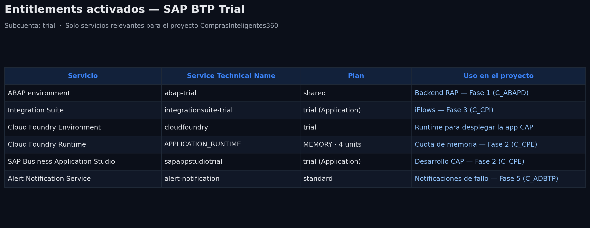

# Administración de la cuenta BTP

Configuración base de la subcuenta trial de SAP BTP: entitlements, boosters, role collections, destinos y monitorización de consumo.

## Entitlements y boosters activados

*(Explica en 1-2 frases qué servicios activaste y con qué booster: "Prepare an Account for ABAP Trial" para el ABAP Environment, "Enable Integration Suite" para Cloud Integration.)*

## Role Collections

*(Explica qué roles se asignaron automáticamente al ejecutar los boosters y para qué sirve cada uno, por ejemplo: rol de administración del ABAP Environment, rol de Integration_Provisioner para Integration Suite.)*

## Destino hacia el backend ABAP

*(Explica qué tipo de destino creaste, hacia qué URL apunta y qué tipo de autenticación usa. Esta pieza se usará en la Fase 2 para que la app CAP consuma el servicio OData del backend ABAP como servicio remoto.)*

## Monitorización de consumo

*(Una frase sobre por qué es importante vigilar esto en un entorno trial: evitar quedarte sin cuota antes de terminar el proyecto.)*

## Resumen

*(2-3 frases de cierre: qué queda listo para las siguientes fases y qué certificación demuestra este trabajo.)*
